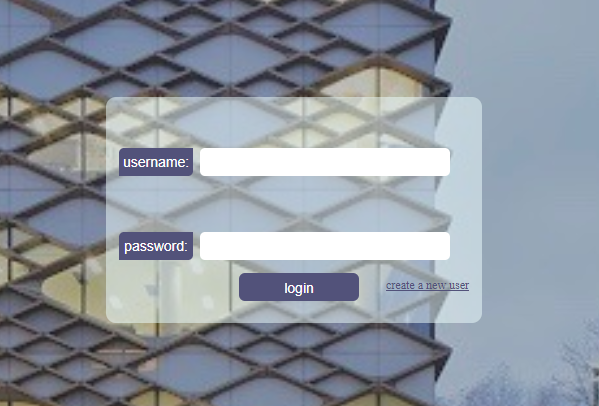
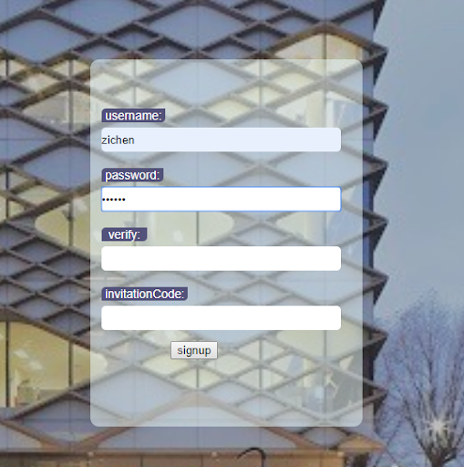
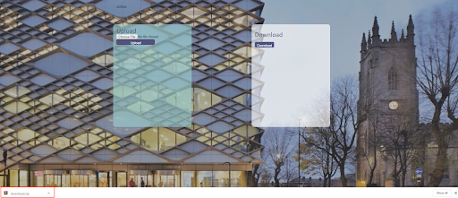
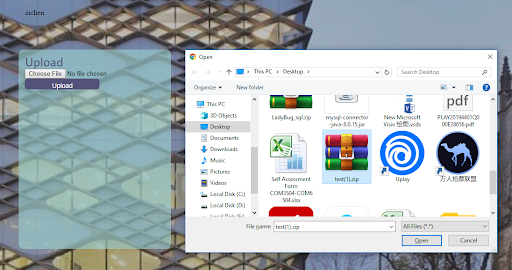
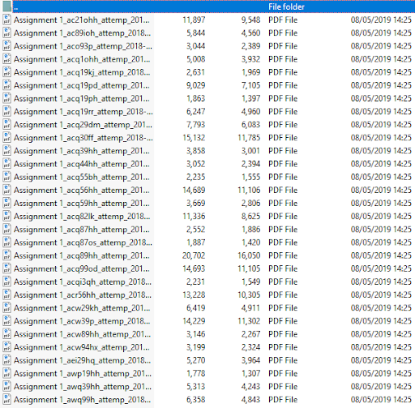

# LADYBUG - A Web-based Code Similarity Detection Tool

Homepage: [LadyBug - Code Similarity Detection Tool](http://142.93.203.80:8080/LadyBug/)

## Features of our product

**Easy to use:** Users only need to simply register and log in, upload the zip file to get the code detection result.

**Efficient:** It takes only 1 second for the user to detect the code repetition of 100 students.

**Functional:** Our product can detect not only the directly-copied code but also some complex similarity situations, i.e. change variable name, change for/while loop, change if/switch condition, methods and etc.

# User Guid v-3.0.0

This version run on a server, what you need is just a browser. Click [Here](http://142.93.203.80:8080/LadyBug/ ) to open our homepage.
You need register a new account or login directly if you have already had an account.

After logging in successfully, the user enters the upload page. 
The user can select the zip file by using the “choose file” button on the computer 
and click the “upload” button to upload the file.

Here is the sample code files in the zip file. Make sure that the file names are in the format of given structure as: 
“[Assignment]\_[Student ID]\_[Attempt]\_[Date]\_[File Name]”. 

# Change Log

## v[0.3.0] - 10.05.07

### Featured

- using the code similarity detection tool on any internet-connected computer
- upload the code zip file and download the similarity report immediately

### Fix

- similar-structured code blocks detection for For/While Loops and Switch/If statement blocks
- PDF generation bug on bi-highlight the detected code

### User Guide:

1. open the login web: [Lady_Bug](142.93.203.80:8080/LadyBug)
2. use the invited code for registration
3. login and upload the zip file whose name of codes are specific named followed by our guide
4. download the zipped pdf report when the download bottom lighted (hopefully no waiting for more than 2 seconds)

## v[0.2.0] - 10.04.21

### Featured

- download the code similarity detection excusable file on your own computer
- the user interface is webpage liked 
- upload the code zip file and download the similarity report immediately
- generate the pdf report for each student

### Add

- name-changed variables detection
- similar-structured code blocks detection

### User Guide:

1. download the release zip file and run on your computer
3. login and upload the zip file whose name of codes are specific named followed by our guide
4. download the zipped pdf report when the download bottom lighted (hopefully no waiting for more than 2 seconds)

## v[0.1.0] - 19.03.21
### Featured
- run as Command Line Tool
- detecting directly copied code

### User Guide:
1. download this version zip
2. put the files you want to detect copy in the direction "src/test_data"
3. run [SimilaryityDecectionModel.java]
4. the results will show in Terminal
